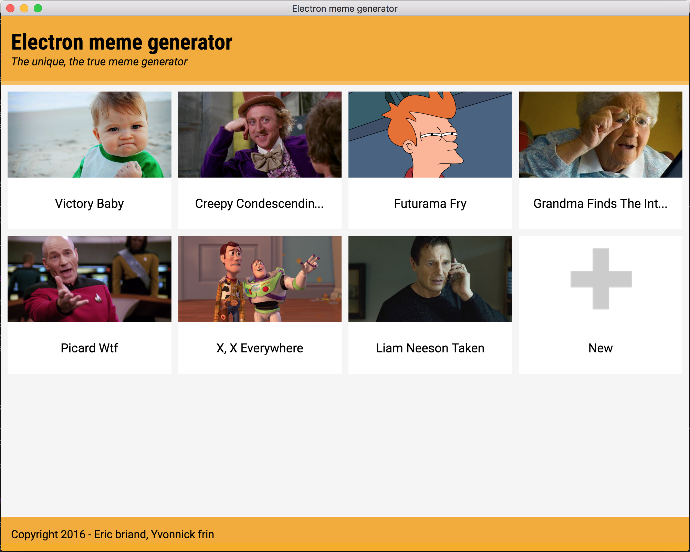

[](http://electron.atom.io/)

# Electron meme generator

## Talk

A demonstration app for the talk called "Développez des applications web desktop avec Electron de Github" by Eric Briand and Yvonnick Frin.

You can found our slides at https://github.com/frinyvonnick/electron-meme-generator/tree/master/slides

## Application

Electron meme generator let you :
 - Import pictures
 - Add text on imported pictures
 - Save on your disk modified pictures

Electron meme generator is build with the electron framework from github and vanilla javascript. The styling part is made with less preprocessor.



## Electron

The project folder structure is inspired from https://github.com/electron/electron-api-demos/blob/master/docs.md

You can find great compilation of resources about electron and his ecosystem at https://github.com/sindresorhus/awesome-electron

# How to use

## Download sources

```bash
git clone https://github.com/frinyvonnick/electron-meme-generator.git
```

## Install dependencies

```bash
npm install
```

## Launch app

```bash
npm start
```

## Launch app in dev mode

Dev mode enable hot-reload and watch less files to compile changes on runtime

```bash
npm run dev
```

## Package app

```bash
electron-packager . --all
```
